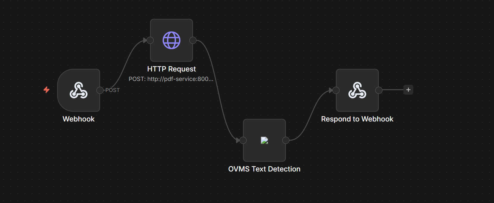
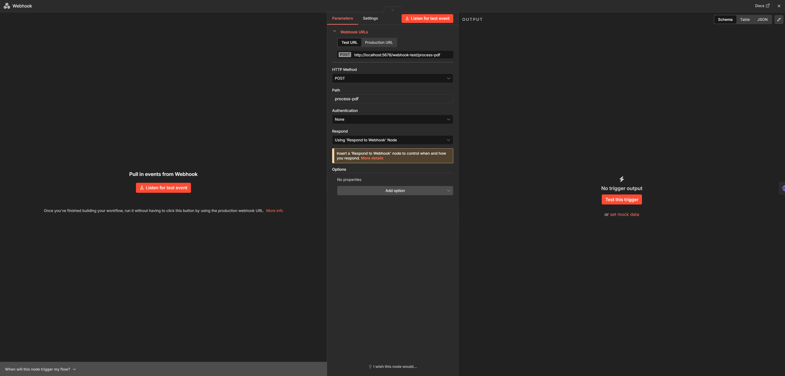
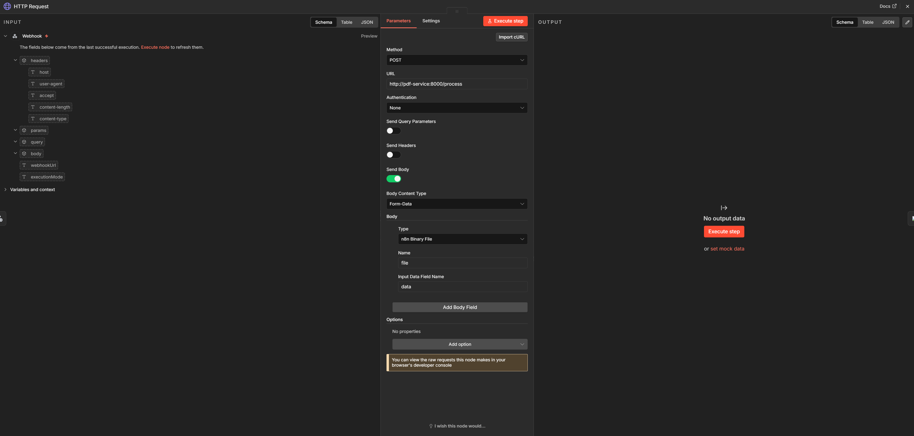
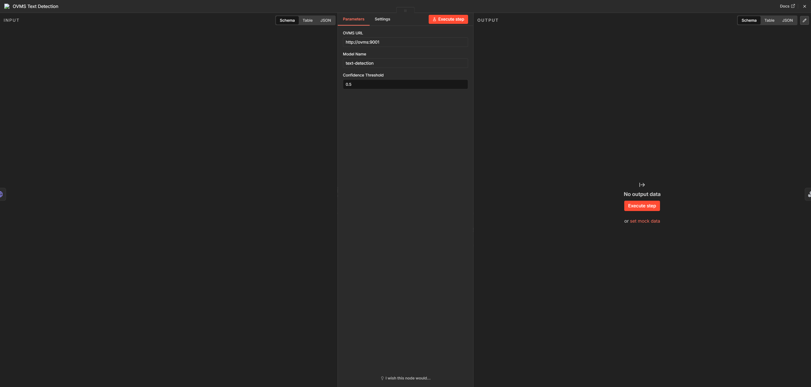
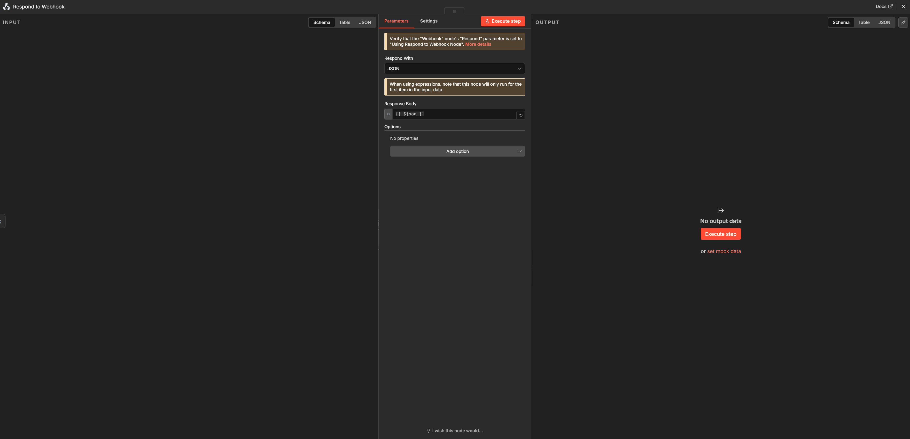

# OpenVINO + n8n Smart Document Processing Prototype

## Overview

The focus of this prototype is a **Smart Document Processing Pipeline** where:

- A PDF is uploaded via an n8n webhook.
- It is converted into an image and then into a tensor using a preprocessing service.
- The tensor is sent to OVMS for inference, i.e. text detection.
- The result is returned as structured output in terminal.

The system is fully containerized and runs using Docker Compose.

---

## What this prototype demonstrates

- Custom **n8n node** for OVMS inference
- Modular architecture (preprocessing separated from inference)
- End-to-end pipeline: PDF → Tensor → OVMS → Output
- Containerized deployment : setup with a single command

---

## Architecture

```
PDF → n8n Webhook → Flask Preprocessing Service → OVMS → n8n Custom Node → Response
```

### Components

- **n8n** → Workflow orchestration
- **Custom OVMS Node** → Handles inference requests
- **Flask Service** → Converts PDF → image → tensor
- **OVMS** → Runs text detection model

---

## Setup Instructions

### 1. Build the custom n8n node

Run from project root:

```
cd n8n-nodes-ovms
npm run build
cd ..
```

---

### 2. Start all services (n8n + OVMS + preprocessing)

```
docker compose up --build
```

This will:
- Build the Flask preprocessing service
- Start OVMS with the text detection model
- Start n8n with the custom node loaded

---

### 3. Access services

- n8n → http://localhost:5678
- OVMS → http://localhost:9001
- Preprocessing service → http://localhost:8000

---

## Running the Workflow

### Step 1
Open n8n and execute the workflow

### Step 2
Send a test request using curl:

```
curl.exe -X POST http://localhost:5678/webhook-test/process-pdf ^
  -F "data=@test_document.pdf"
```

### Expected Output

```
{
  "text_pixels": ...,
  "text_coverage_percent": ...,
  "has_text": true
}
```

---

## Demo Screenshots

**Workflow**



**Webhook Node**



**HTTP Request Node**



**OVMS Node**



**Webhook Response Node**




---

## Notes

- The preprocessing service currently processes only the first page of a PDF
- The OVMS node expects a tensor input (handled by the preprocessing service)
- Model must be placed in correct OVMS format:

```
/models/text-detection/1/model.xml
```

---

## Future Improvements

- Support for multi-page documents.
- Additional workflow templates.
- Integrate LLM-based classification and entity extraction on extracted document text.
- Hardware-aware routing (CPU/GPU/NPU).

---

## Summary

This project is a prototype that integrates n8n with OpenVINO Model Server (OVMS) to build an end-to-end document processing workflow. The idea is to take something like a PDF, pass it through a preprocessing step to convert it into a format the model understands, and then run inference using OVMS through a custom n8n node. The workflow is designed in a modular way, where preprocessing, inference, and orchestration are handled as separate components, making it easier to extend and reuse. Everything is containerized and can be run with a single Docker Compose command, so the entire setup is reproducible. Overall, this prototype shows how n8n can be used to visually build AI-powered workflows while leveraging OpenVINO for efficient model inference, and it sets the foundation for adding more advanced steps like multi-page processing or LLM-based document understanding later on.

