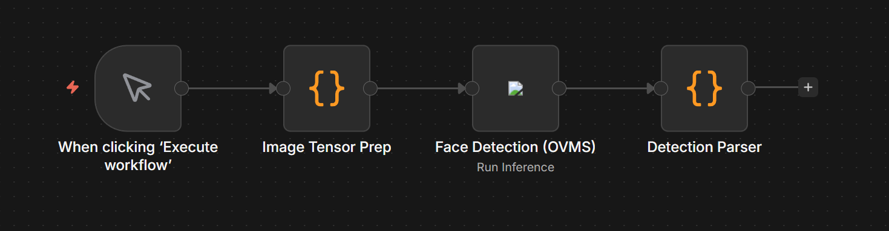
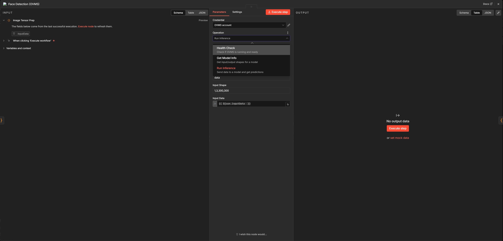

# n8n-nodes-ovms

A custom n8n node that lets you run AI inference through OpenVINO Model Server directly from an n8n workflow — no code needed on the user's end.

Built as part of my GSoC 2026 application for Project #13 under OpenVINO.

---

## What this is

Running inference with OpenVINO right now requires you to write code — handle tensors, call APIs, parse responses. The goal is to wrap all of that inside an n8n node so anyone can build AI pipelines visually without touching inference code.

This repo is my working prototype that proves the core integration works. The node connects to a running OVMS instance, lets you pick which Intel device to run on (CPU, GPU, NPU, or AUTO), and returns inference results as clean JSON that flows into the next node in your workflow.

To demonstrate it end to end, I built a face detection workflow in n8n. It detects a face in a real image and returns the bounding box coordinates. Screenshots of every step are in the `screenshots/` folder.

---

## What this prototype is not

This is not the finished project. Right now users have to supply raw float tensors as input data which isn't practical at all. Input preprocessing helpers that let users pass images or text directly are a big part of what the actual GSoC project would build. Same with the Podman Compose deployment, the AUTO plugin observability, and the full document processing pipeline — those are all planned, not in this prototype.

The prototype's job is just to show the integration works before building on top of it.

---

## Demo



Face detected at 96.76% confidence with bounding box coordinates returned as structured JSON. Full output screenshots are in the `screenshots/` folder.

---

## System architecture

The setup is two Docker containers — n8n and OVMS — with the custom node acting as the bridge between them.

When a workflow hits the OVMS node, it reads the user's inputs, builds a KServe v2 JSON payload, sends it to OVMS over REST, gets back an output tensor, and returns structured JSON to the next node. All the actual computation happens inside OVMS. The TypeScript node is just translating between n8n and the OVMS API.

```
    n8n canvas
        │
        ▼
OpenVINO Model Server Node 
  reads inputs from the UI
  builds KServe v2 payload
  POST /v2/models/{name}/infer
  parses the response
  returns JSON to next node
        │
        ▼
OpenVINO Model Server  (Docker, port 9001)
  loads IR model files
  routes to CPU / GPU / NPU / AUTO
  returns output tensor
        │
        ▼
OpenVINO Runtime
  runs the inference
```


## What the node does

The node has three operations you pick from a dropdown.

**Health Check** — asks OVMS if it's up and ready. Good to use at the start of any workflow that depends on OVMS being available.

**Get Model Info** — asks OVMS for the input and output specs of a loaded model. Tells you the input tensor name, shape, and datatype. You need this before you can run inference because the node requires you to fill those values in manually right now.

**Run Inference** — the main one. You give it a model name, device, input tensor name, shape, and data. It sends everything to OVMS and returns the output tensor as JSON along with some metadata about what ran and where.

### Device selection

Every inference call has a device dropdown:

- **AUTO** — OpenVINO figures out the best available device at runtime. This is the default and what you'd want on an Intel AI PC.
- **CPU** — runs on CPU.
- **GPU** — runs on Intel integrated or discrete GPU.
- **NPU** — runs on Intel's Neural Processing Unit.

The selected device shows up in `device_requested` in the output. One thing worth noting — `executed_on` currently just mirrors whatever you picked. Proper AUTO plugin observability where it tells you what device OpenVINO actually used is something I want to add in the full project.

### Works with any model

Nothing in the node is hardcoded to face detection or any specific model. The model name, input name, and input shape are all fields you fill in. Swap them out and it works with any model OVMS is serving.

---

## Setup

### What you need

- Docker Desktop
- Python 3.11 with dependencies from `requirements.txt`
- Node.js 18+

### 1. Start OVMS

The `ovms_models/` folder already has the face-detection model set up in the right directory structure.

```bash
# Windows PowerShell
docker run -d `
  --name ovms `
  -p 9000:9000 `
  -p 9001:9001 `
  -v "${PWD}\ovms_models:/models" `
  openvino/model_server:latest `
  --model_path /models/face-detection `
  --model_name face-detection `
  --port 9000 `
  --rest_port 9001

# Linux / Mac
docker run -d \
  --name ovms \
  -p 9000:9000 \
  -p 9001:9001 \
  -v "$(pwd)/ovms_models:/models" \
  openvino/model_server:latest \
  --model_path /models/face-detection \
  --model_name face-detection \
  --port 9000 \
  --rest_port 9001
```

Check it started:

```bash
docker logs ovms
# look for: "state": "AVAILABLE"

curl http://localhost:9001/v2/health/ready
# should return HTTP 200
```

### 2. Build the n8n image

```bash
docker build -t n8n-with-ovms .
```

### 3. Start n8n

```bash
# Windows PowerShell
docker run -d `
  --name n8n `
  -p 5678:5678 `
  -e N8N_SECURE_COOKIE=false `
  -v "$env:APPDATA\n8n:/home/node/.n8n" `
  -v "${PWD}\n8n-nodes-ovms\dist:/home/node/.n8n/custom/node_modules/n8n-nodes-ovms" `
  n8n-with-ovms

# Linux / Mac
docker run -d \
  --name n8n \
  -p 5678:5678 \
  -e N8N_SECURE_COOKIE=false \
  -v ~/.n8n:/home/node/.n8n \
  -v "$(pwd)/n8n-nodes-ovms/dist:/home/node/.n8n/custom/node_modules/n8n-nodes-ovms" \
  n8n-with-ovms
```

Open `http://localhost:5678`.

> **Note on Docker networking:** Both containers run in Docker so `localhost` inside n8n points to itself. Use your actual local IP when setting up OVMS credentials in n8n. Something like `http://192.168.1.100:9001`.

### 4. Add credentials

Search for the OpenVINO Model Server node in n8n, add it to a workflow, and enter your OVMS server URL when it asks for credentials.

### 5. After making code changes

```bash
cd n8n-nodes-ovms
npm run build
docker restart n8n
```

---

## Running the face detection demo

### Check inference works via Python first

Install the dependencies:

```bash
pip install -r requirements.txt
```

Add any photo of a face named `test_face.jpg` to the project root, then:

```bash
python test_face_detection.py
```

If this prints a detection with confidence above 0.3, the inference is working.

### Build the workflow

Four nodes connected in order:

**Node 1 — manual trigger**

Default "When clicking Execute workflow" node.

**Node 2 — Image Tensor Prep (Code node)**

Run this to generate the tensor data from your image:

```bash
python scripts/prepare_code_node.py
```

It writes `scripts/code_node.js`. Copy the entire contents and paste into the Code node.

**Node 3 — OVMS node**



**Node 4 — Detection Parser (Code node)**

```javascript
const rawOutput = $input.first().json.raw_output;
const detections = [];
for (let i = 0; i < rawOutput.length; i += 7) {
    const confidence = rawOutput[i + 2];
    if (confidence > 0.3) {
        detections.push({
            face_number: detections.length + 1,
            confidence: confidence.toFixed(4),
            bounding_box: {
                x1: rawOutput[i + 3].toFixed(3),
                y1: rawOutput[i + 4].toFixed(3),
                x2: rawOutput[i + 5].toFixed(3),
                y2: rawOutput[i + 6].toFixed(3)
            }
        });
    }
}
return [{
    json: {
        total_faces_detected: detections.length,
        detections: detections,
        model: $input.first().json.model_name,
        executed_on: $input.first().json.executed_on
    }
}];
```

Execute the workflow. Check the `screenshots/` folder to see what the output looks like at each step.
